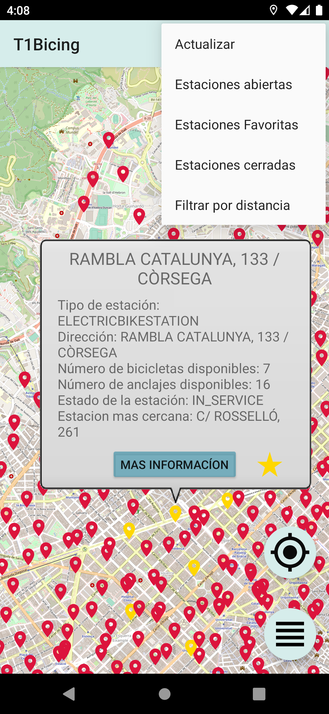
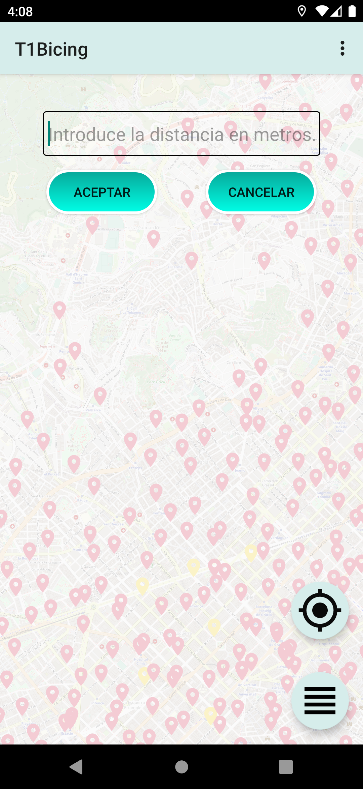
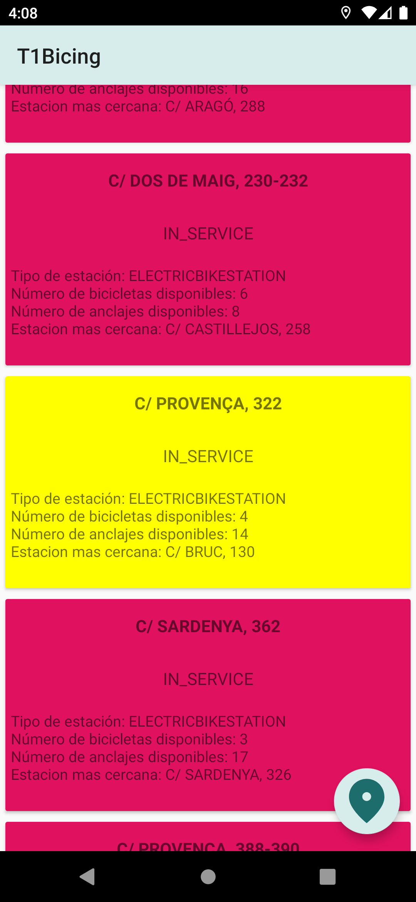
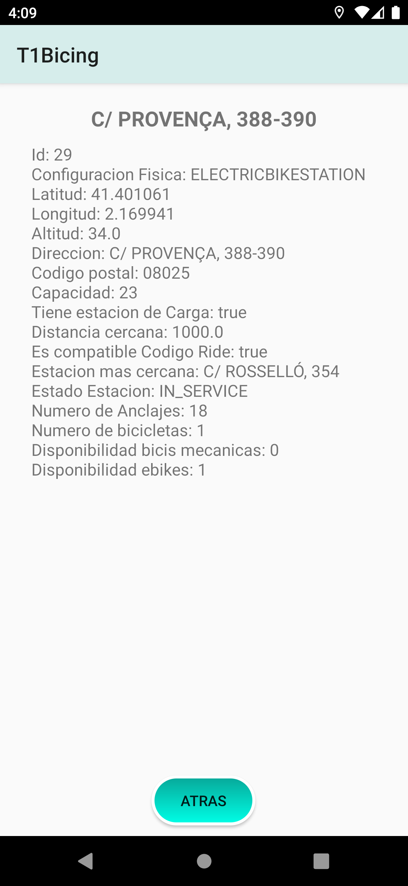

# Bike_Point - Aplicación de Localización de Estaciones de Bicicletas

Bike_Point es una aplicación desarrollada en Android Studio que proporciona una solución práctica para localizar estaciones de bicicletas en la ciudad de Barcelona. Este proyecto representa un esfuerzo dedicado a ofrecer a los usuarios una herramienta eficiente y fácil de usar para mejorar su experiencia de movilidad urbana.

## Capturas de Pantalla

&nbsp;&nbsp;
&nbsp;&nbsp;
&nbsp;&nbsp;

## Características Principales

1. **Actualización en Tiempo Real**
   - Garantiza la frescura de los datos mediante la implementación de una conexión a una fuente de datos en tiempo real, asegurando que los usuarios siempre dispongan de información actualizada sobre la disponibilidad de bicicletas.

2. **Estaciones Abiertas**
   - Explora la presentación dinámica y actualización de la disponibilidad de bicicletas y espacios en las estaciones abiertas. La aplicación destaca por la manipulación eficiente de datos en tiempo real y la presentación clara y concisa de la información.

3. **Estaciones Favoritas**
   - Implementa la funcionalidad de marcar y desmarcar estaciones favoritas, almacenando datos localmente. Esta característica brinda a los usuarios una experiencia personalizada y práctica al permitirles gestionar sus ubicaciones preferidas.

4. **Estaciones Cerradas**
   - Gestiona y visualiza estaciones temporalmente cerradas, mejorando la experiencia del usuario al informar sobre la disponibilidad actual y proporcionar alternativas cercanas.

5. **Filtrar por Distancia**
   - Integra un filtro por distancia para personalizar las búsquedas de estaciones cercanas. La aplicación utiliza la ubicación del usuario para filtrar datos según criterios específicos, mejorando la eficiencia en la búsqueda de estaciones de bicicletas.

# Instrucciones para Configurar

1. **Descarga el Proyecto:**
   - Clona o descarga el proyecto desde el repositorio de GitHub [enlace del repositorio].

2. **Configuración del Entorno de Desarrollo:**
   - Asegúrate de tener Android Studio configurado y actualizado en tu sistema.

3. **Explora el Código:**
   - Estudia el código fuente para comprender la implementación de las diferentes características y su integración en la aplicación.

4. **Haz Cambios y Experimenta:**
   - Experimenta con el código para adaptarlo a tus necesidades o mejorar la funcionalidad de la aplicación.

 
Bike_Point es un proyecto de aprendizaje explora las características y desarrolla con Bike_Point.